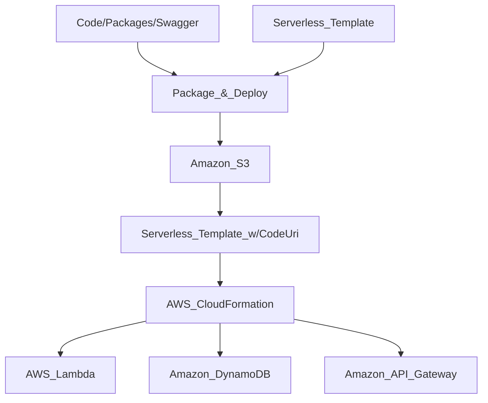
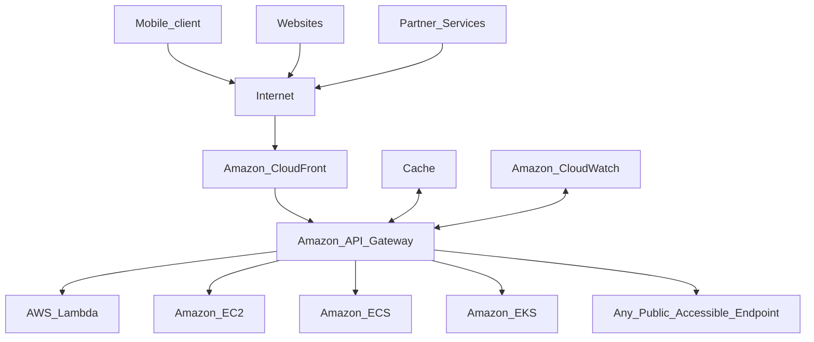
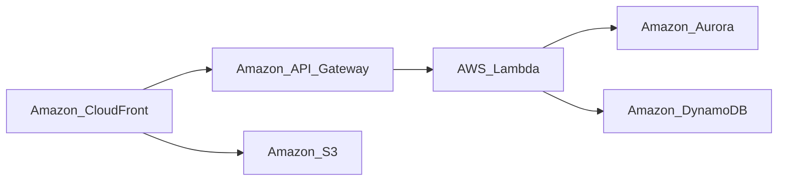
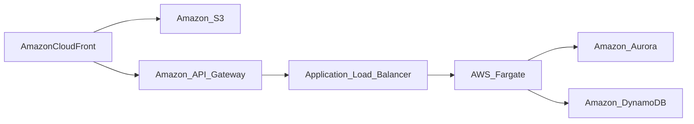
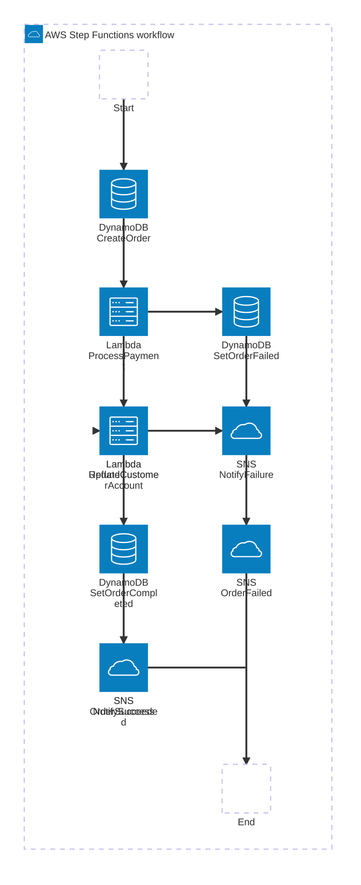
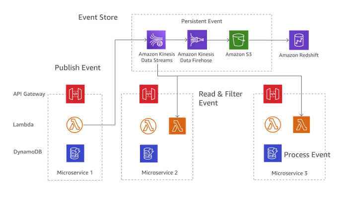
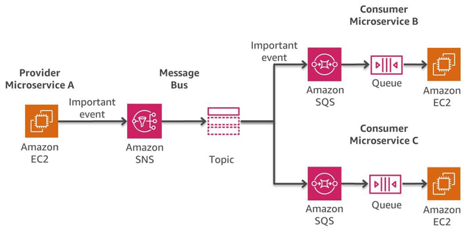

# Implementing Microservices on AWS

> Notes on the AWS whitepaper on July 24th, 2026.
> This are just notes to help me follow the subject.
> Sometimes I just type the content to my notes without changing anything.
> Sometimes I resume, or substract what I consider non neccesary.
> Sometimes I expand on the text, usually to bring to the text some of the explanations embeded into figures.

MIcroservices offer a streamlined approach to software development that accelerates deployment, encourages innovations, enhances maintainability, and boosts scalabitily. This method relies on small, loosely coupled services that communicate through well-defined APIs, which are managed by autonomuos teams. Adopting microservices offers benefits, such as improved scalability, resilieance, flexibility, and faster development cycles.

This whitepaper explores three popular microservices patterns: API driven, event driven, and data streaming. We provide an overview of each approach, outline microservices key features, adress the challenges in their development, and illustrate how AWS can help application teams tackle these obstacles.

Considering the complex nature of topics like data store, asynchronous communication, and service discovery, you are encouraged to weigh your application's specific needs and use cases alongside the guidance provided when making architectural decisions.

## Introduction

Microservices architectures combine successful and proven concepts from various fields, such as:

- Agile software development
- Service-oriented architectures
- API-first design
- Continuous integration/Continuous delivery

Often, microservices incorporate design patterns from the [Twelve-Factor App](https://12factor.net/).

Even though microservices offer many benefits, it is still important to assess your use case and associated costs. Monolithic architectures or alternative approaches may be more appropiate in some cases. Deciding between microservices or monoliths should be made on a case-by-case analysis, considering scale, complexity, and specific use cases.

We first explore a highly scalable, fault-tolerant microservices architecture (user interface, microservices implementation, data store), and demonstrate how to build it on AWS using container technologies. We then suggest AWS services to implement a typical serverless microservices architecture, reducing operational complexity.

Serverless is characterized by the following principles:
- No infrastructure to provision or manage.
- Automatically scaling by unit of consumption
- "Pay for value" billing model
- Built-in availability and fault tolerance
- Event Driven Architecture (EDA)

Lastly, we examine the overall syste, and discuss cross-service aspects of a microservices architecture, such as distributed monitoring, loggin, tracing, auditing, data consistency, and asynchronous communication.

This document focuses on workloads running in the AWS Cloud, excluding hybrid scenarios and migration strategies. For information on migration strategies, refere to the [Container Migration Methodology whitepaper](https://d1.awsstatic.com/whitepapers/container-migration-methodology.pdf).

## Are you Well-Architected?

The AWS Well-Architected Framework helps you understand the pros and cons of the decisions you make when building systems in the cloud. The six pillars of the Framework allow you to learn architectural best practises for designing and operating reliable, secure, efficient, cost-effective and sustainable systems. Using the AWS Well-Architedted Tool, free of charge in the AWS Management Console, you can revier your workload against these best practises by ansering a set of questions on each pillar.

In the [Serverless Application Lens](https://docs.aws.amazon.com/wellarchitected/latest/serverless-applications-lens/welcome.html), we focus on the best practises for architecting your serverless applications on AWS.

## Modernizing to microservices

Microservices are essentially small, independent units that make uo an application. Transitioning from traditional monolithic structures to microservices can follow [various strategies](https://docs.aws.amazon.com/prescriptive-guidance/latest/modernization-decomposing-monoliths/decomposing-patterns.html)

This transition also impacts the way your organization operates:
- It encourages agile development, where teams work in quick cycles.
- Teams are typically small, sometimes described as _two-pizza teams_.
- Teams take full responsability for their services, from creation to deployment and maintenance.

## Simple microservices architecture on AWS

Typical monolithic applications consist of different layers: a presentation layer, an application layer and a data layer.

Microservices, on the other hand, separate functionalities into cohesive verticals according to specific domains, rather than technological layers. Figure 1 ilustrates a reference architecture for a typical microservice application on AWS:

> Description of figure 1
> Imagine three columns, this colums are at the same time containes, they hold different services, grouped by functional subject: User Interface, Compute Implementation, and Data Store (Basically the same MVC model from the monolith)
> Inside the first column, **User interface**, we found two services: Amazon CloudFront, Amazon S3.
> Inside the second column, **Compute integration**, we find another two services: ALB and  Amazon ECS
> Inside the third column, **Data Store**, we find three services: Amazon ElastiCache, Amazon Aurora, and Amazon DynamoDB.

### User interface

Modern web applications often use JavaScript frameworks to develop SPA that communicate with backend APIs. These APIs are tipically built using Representation State Transfer (REST), or RESTful APIs, or GraphQL APIs. Static web content can be served using Amazon Simple Storage Service (S3) and Amazon CloudFront.

### Microservices implementations

AWS offers building blocks to develop microservices, including Amazon ECS, and EKS as the choices for container orchestration engines and AWS Fargate and EC2 as hosting options.

AWS Lambda allows you to upload your code, automatically scaling and managing its execution with high availability. It eliminates the need for infrastructure management, so that you can move quickly and focus onyour business logic. Lambda supports multiple programming languages and can be triggered by other AWS services or called directly from web or mobile applications.

Container-based applications have gained popularity due to portability, productivity, and efficiency. AWS offers serveral services to build, deploy and manage containers.

- App2Container, a command line tool for migrating and modernizing Java and .NET web apps into container format. AWS A2C analyzes and builds an inventory of applications running in bare metal, virtual machines, Amazon Elastic Compute Cloud (EC2) instances or in the cloud.

- Amazon Elastic Container Service (ECS) and Elastic Kubernetes Service (EKS) manage your container infrastructure, making it easier to launch and maintain containerized applications.

- Amazon EKS is a managed Kubernetes service to run Kubernetes in the AWS cloud and on on-premises data centers ([Amazon EKS Anywhere](https://aws.amazon.com/eks/eks-anywhere/)). This extends cloud services into on-premises environments for low-latency, local data processing, high data transfer costs, or data residency requirementes. You can use all the existing plug-ins and tooling from the Kubernetes community with EKS.

- Amazon Elastic Container Service (ECS) is a fully managed container orchestration service that simplifies your deployment, management, and scaling of containerized applications. Customers choose ECS for simplicity and deep integration with AWS services.

- AWS App Runner is a fully managed container service that lets you build, deploy, and run conatinerized web applications and API services without prior infrastructure or container experience.

- AWS Fargate, a serverless compute engine, works with Amazon ECS and EKS to automatically manage compute resources for container applications.

- Amazon ECR is a fully managed container registry offering high-performance hosting, so you can reliably deploy application images and artifacts anywhere.

### Continuous integration and continuous deployment (CI/CD)

Continuous integration and continuous delivery (CI/CD) is a crucial part of a DevOps initiative for rapid software changes. AWS offers services to implement CI/CD for microservices, but a detailed discussion is beyond the scope of this document. For more information, see the Practicing Continuous integration and Continuous Delivery on AWS whitepaper.

### Private networking

AWS PrivateLink is a thecnology that enhances the security of microservices by allowing private connections between your Virtual Private Cloud (VPC) and supported AWS services. It helps isolate and secure microservices traffic, ensuring it never crosses the public internet. This if particularly usesful for complying with regulations like PCI or HIPAA.

### Data store

The data store is used to presist data needed by the microservices. Popular stores for session data are in-memory-chaces such as Memcached or Redis. AWS offers both technologies as part of the managed Amazon ElastiCache service.

Putting a cache between application servers and a database is a common mechanism for reducing the read load on the database, which, in turn, may allow resources to be used to support more writes. Caches can also improve latency.

Relational databases are still very popular to stored structured data and business objects. AWS offers six databases engines (Microsoft SQL Server, Oracle, MySQL, MariaDB, PostgreSQL, and Amazon Aurora) as managed services through [Amazon Relational Database Servie](https://aws.amazon.com/rds/) (Amazon RDS)

Relational databases are, however, not desing for endless scale, which can make it difficult and time insentive to apply techniques to support a high number of queries.

NoSQL databases have been designed to favor scalability, performance, and availability over the consistency of relational databases. One important element of NoSQL databases is that they tipically don't enforce strict schema. Data is distributed over partitions that can be scaled horizontally and is retrived using partition keys.

Because individual microservices are designed to do one thig well, they tipically have a simplified data model that might be well suited to NoSQL persistence. It is  important to undestand that NoSQL databases have different access patterns that relational databases. For example, it's not possible to join tables. If this is necessary, the logic has to be implemented in the application. You can use Amazon DynamoDB to create a database table that can store and retrieve any amount of data and serve any level of request traffic. DynamoDB delivers single-digit milisecond performance, however, there are certain use cases that require response times in microseconds. DynamoDB Accelerator (DAX) provides caching capabilities for accesing data.

DynamoDB also offers an automatic scaling feature to dynamically adjut thorughput capacity in response to actual traffic. However, there are cases where capacity planning is difficult or not possible because of large activity spikes of short duration in your application. For such situations, DynamoDB provides an on-demand option, which offers simple pay-per-request pricing. DynamoDB  on-demand is capable of serving thousands of requests per second instantly without capacity planning.

For more information, visit [#Distributed data management](##distributed-data-management) and [How to Choose a Database](https://aws.amazon.com/startups/learn/maximizing-performance-with-aws-databases)

## Simplifying operations

TO further simplify the operational efforts needed to run, maintain, and monitor microservices, we can use a fully serverless architecture.

### Deploying Lambda-based applications

You can deploy your Lambda code by uploading a zip file or by creating and uploading a container image through the console UI using a valid Amazon ECR image URI. However, when a Lambda function becomes complex, meaning it has layers, dependencies, and permissions, uploading through the UI can become unwieldy for code changes.

Using AWS CloudFormation and the AWS Serverless Application Model ([AWS SAM](https://github.com/awslabs/serverless-application-model)), AWS Cloud Development Kit (AWS CDK), or Terraform streamlines the process of defining serverless applications. AWS SAM, natively supported by CloudFormation, offers a simplified syntax for specifying serverless resources. AWS Lambda Layers help manage shared libraries across multiple Lambda functions, minimizing function footprint, centralizing tenant-aware libraries, and improving the developer experience. Lambda SnapStart for Java enhances startup performance for latency-sensitive applications.

To deploy, specify resources and permissions policies in a CloudFormation template, package deployment artifacts, and deploy the template. SAM Local, an AWS CLI tool, allows local development, testing, and analysis of serverless applications before uploading to Lambda.

Integration with tools like AWS Cloud9 IDE, AWS CodeBuild, AWS CodeDeploy, and AWS CodePipeline streamlines authoring, testing, debugging, and deploying SAM-based applications.

THe following mermaid diagram shows what deploying to AWS Serverless Application Model resources using CloudFormation and AWS CI/CD tools looks like.

## Abstracting multi-tenancy complexities.

In a multi-tenant environment, like SaaS platforms, it's crucial to streamline the intrincates related to multi-tenancy, freeing up developers to concentrate on feature and functionality development. This can be achieved using tools such as AWS Lambda Layers which offer shared libraries for addressing cross-cutting concerns. The rationale behind this approach is that shared libraries and tools, when used correctly, efficiently manage tenant content.

However, they should not extend to encapsulating business logic due to the complexity and risk they may introduce. A fundamental issue with shared libraries is the increased complexity surrounding updates, making them more challenging to manage compared to standard code duplication. Thus, it's essential to strike a balance between the use of shared libraries and duplication in the quest for the most effective abstraction.

## API management

Managing APIs can be time-consuming, especially when considering multiple versions, stages of the development cycle, authorization, and other features like throttling and caching. Apart from AWS API Gateway, some customers also usl ALB (Application Load Balancer) or NLB (Network Load Balancer) for API management. Amazon API Gateway helps reduce the operational complexity of creating and maintaining RESTful APIs. It allows you yo create APIs programmatically, serves as a "front door" to access data, business logic, or functionality from your backend services, Authorization and access control, rate limiting, caching, monitoring, and traffic management and runs APIs without managing servers.

Figure 3 illustrates how API Gateway handles API calls and interacts with other components.

## Microservices on serverless technologies

Using microservices with serverless technologies can greatly decrease operational complexity. AWS Lambda and AWS Fargate, integrated with API Gateway, allows for the creation of fully serverless applications. Since 2023, Lambda functions can progressively stream response payloads back to the client, enhancing performance for web and mobile applications. Before this, Lambda-based applications using the traditional request-response invocation model had to generate and buffer the response before returning it to the client, which could delay the time to first byte. With response streaming, functions can send partial responses back to the client as they become ready, significantly improving the time to first byte, which web and mobile applications are especially sensitive to.

The next graph demonstrates a serverless microservice architecture using AWS Lambda and managed services. This serverless architecture mitigates the need to design for scale and high availability, and reduces the effort needed for running and monitoring the underlying infrastructure.

CloudFront and S3 belong to the User Interface block.
API Gateway and Lambda to the Compute implementation.
Aurora and DynamoDB to the Data Store.

The next graph displays a similar serverless implementation using containers with AWS Fargate, removing concerns about underlying infrastructure. It also features Amazon Aurora Serverless, the on-demand, autoscaling database that adjusts capacity based on your application requirements.

## Resilient and efficient systems

### Disaster recovery (DR)

Microservices applications often follow the Twelve-Factor Application patterns, where processes are stateless, and persistent data is stored in stateful backing services like databases. This simplifies disaster recovery (DR) because if a service fails, it's easy to launch new instances to restore functionality.

Disaster recovery strategies for microservices should focus on downstreams services that maintain the application's state, such as file systems, databases, or queues. Organizations should plan for recovery time objective (RTO) and recovery point objective (RPO). RTO is the maximum acceptable delay between service interruption and restoration, while RPO is the maximum time since the last data recovery point.

More on disaster recovery strategies in the [AWS Disaster Recovery of Workloads: Recovery in the Cloud](https://docs.aws.amazon.com/whitepapers/latest/disaster-recovery-workloads-on-aws/disaster-recovery-workloads-on-aws.html)

### High availability (HA)

We will examine high availability of various components of a microservices architecture.

Amazon EKS provides HA by running Kubernetes control and data plane instances across multiple availability zones. It automatically detects and replaces unhealthy control plane instances and provides automated version upgrades and patching.

Amazon ECR uses Amazon S3 for storage to make your container images highly available and accesible. It works with Amazon EKS, ECS, and Lambda, simplifying development to production workflow.

ECS is a regional service that simplifies running containers in a highly available manner across multiple Availability Zones within a Region, offering multiple scheduling strategies that place containers  for resource needs and availability requirements.

Lambda operates in multiple Availability Zones, ensuring availability during service interruptions in a single zone. If connectiong your function to a VPC, specify subnets in multiple Availability Zones for high availability.

## Distributed systems components

In a microservices architecture, **service discovery** is the process of dynamically locating and identifying the network locations (IP addresses and ports) of individual microservices within a distributed system.

When choosing an approach on AWS, consider factors such as:

- Code modificacion: Can you get the benefits without modifying code?
- Cross-VPC or cross-account traffic: If required, does your system need efficient management of communication accors different VPCs or AWS accounts?
- Deployment strategies: Does your system use or plan to use advance deployment strategies such as blue-green or canary deployments?
- Performance considerations: If your architecture frequently communicates with external services, what will be the impact on overall performance?

AWS offers several methods for implementing service discovery in your microservices architecture:

- ECS service discovery: ECS supports service discovery using its DNS-based method or by integrating with AWS Cloud Map. ECS Service Connect further improves connection management, which can be especially beneficial for larger applications with multiple interacting services.

- Amazon Route 53: Route 53 integrates with ECS and other services, like EKS, to facilitate service discovery. In an ECS context, Route 53 can use the ECS Service Discovery feature, which leverages the Auto Naming API to automatically register and deregister services.

- AWS Cloud Map: This offers dynamic API-based service discovery, which propagates changes across your services.

For more advanced communications needs, Amazon VPC Lattice is an application networking service that consistenly connects, monitors, and secures communications between your services, helping to improve productivity so that your developers can focus on building features that matter to your bussiness. You can define policies for network traffic management, acces, and monitoring to connect compute services in a simplified and consistent way accross instances, containers, and serverless applications.

If your are already using third party software like HashiCorp Consult, Netflix Eureka, for service discovery, you might preffer to continue using this while you migrate.

## Distributed data management

In traditional applications, all components often share a single database. In contrast, each component of a microsevice-based application maintaings its own data, promoting independence and decentralization. This approach, known as distributed data management, brings new challenges.

One such challenge arises from the trade-off between consistency and performance in distributed systems. It`s often more practical to accept slight delays in data updates (eventual consistency) than to insist on instant updates (inmediate consistency).

Sometimes, business operations require multiple microservices to work together. If one part fails, you might have to undo some completed tasks. The [Saga Pattern](https://docs.aws.amazon.com/prescriptive-guidance/latest/modernization-data-persistence/saga-pattern.html) helps manage this by coordinating a series of compensating actions.

To help microservices stay in sync, a centralized data store can be used. This store, managed with tools like AWS Lambda, Step Functions, and EventBridge, can assist in cleaning up and deduplicating data.

A common approach in managing changes across microservices is _event sourcing_. Every change in the application is recorded as an event, creating a timeline of the system's state. This approach not only helps debugs and audit but also allows different parts of an application to react to the same events.

Event sourcing often works hand-in-hand with the Command Query Responsibility Seggregation pattern (CQRS), which separates data modification and data querying into different modules for better performance and security.

On AWS, you can implement these patterns using a combination of services. As you can see in the following figure, Amazon Kinesis Data Streams can serve as yout central event store, while Amazon S3 provides durable storage for all event records. AWS Lambda, DynamoDB and API Gateway work together to handle and process these events.

Remember that, in distributed systems, events might be delivered multiple times due to retries, so it's important to design your applications to handle this.

## Configuration management

In a microservices architecture, each service interacts with various resources like databases, queues, and other services. A consistent way to configure each service's connections and operating environment is vital. Ideally, an application should adapt to new configurations without needing a restart. This approach is part of the Twelve-Factor App principles, which recommends storing configurations in environment variables.

A different approach is to use [AWS App Config](https://aws.amazon.com/systems-manager/features/appconfig/). It's a feature of AWS Systems Manager which makes easy for customers to quickly and safely configure, validate, and deploy feature flags and applications configurations. Your feature flag and configurations data can be validated syntactically or semantically in pre-deployment phase, and can be monitored and automatically rolled back if an alarm that you have configured is triggering. AppConfig can be integrated with Amazon ECS and EKS by using the AppConfig agent. The agent functions as a sidecar container running alongside your ECS and EKS container applications. If you use AWS AppConfig feature flags or other dynamic configuration data in a Lambda function, then we recommend that you add the AppConfig Lambda extension as a layer to your Lambda function.

[GitOps](https://github.com/weaveworks/weave-gitops) is an innovative approach to configuration management that uses Git as the source of truth for all your configuration changes. This means that any changes made to your configuration files are automatically tracked, versioned, and audited through Git.

## Secrets management

Security is paramount, so credentials should not be passed in plain text. AWS offers secure services for this, like AWS Systems Managers Parameter Store and AWS Secrets Manager. These tools can send secrets to containers in Amazon EKS as volumes, or to Amazon ECS as environment variables. For Kubernetes workflows, the [External Secrets Operator](https://external-secrets.io/v0.8.5/) fetches secrets directly from services like AWS Secrets Manager, creating corresponding Kubernetes Secrets. This enables a seamless integration with Kubernetes-native configurations.

## Cost optimization and sustainability

Microservices architecture can enhance cost optimization and sustainability. By breaking an application into smaller parts, you can scale up only the services that need more resources, reducing cost and waste. This is particularly useful when dealing with variable traffic. Micorservices are independently developed. So developers can do smaller updates, and reduce the resources spent on e2e testing. While updating they will have to test only a subset of the features as opposed to monoliths.

Stateless components (services that store state in an external data store instead of a local data store) in your architecture can make use of Amazon EC2 Spot instances, which offer unused EC2 capacity in the AWS cloud. These instances are more cost efficient than on-demand instances and are perfect for workloads that can handle interruptions. This can further cut costs while maintaining high availability.

With isolated services, you can use cost-optimized compute options for each auto-scaling group. For example, AWS Graviton offers cost-effective, high-performance compute options for workloads that suit ARM-based instances.

Optimizing costs and resource usages also helps minimize environmental impact, aligning with the [Sustainability pillar](https://docs.aws.amazon.com/wellarchitected/latest/sustainability-pillar/sustainability-pillar.html) of a Well-Architected Framework. You can monitor your progress in reducing carbon emissions using the AWS Customer Carbon Footprint tool. This tool provides insights into the enviromental impact of your AWS usage.

## Communication mechanisms

In the microservices paradigm, various components of an application must communicate over a network. Common approaches for this include REST-based, GraphQL-based, gRPC-based, and asynchronous messaging.

### REST-based communication

The HTTP/S protocol, used broadly for synchronous communication between microservices, often operates through RESTful APIs. API Gatewat offers a streamlined way to build an API that serves as a centralized access point to backend services, handling tasks like traffic management, authorization, monitoring, and version control.

### GraphQL-based communication

Similarly, GraphQL is a widspread method for synchronous communication, using the same protocols as  REST but limiting exposure to a single endpoint. With AWS AppSync, you can create and publish GraphQL applications that interact with AWS services and datastores directly, or incorporate Lambda functions for business logic.

### gRPC-based communication

gRPC is a synchronous, lightweight, high performance, open-source RPC communication protocol. gRPC improves upon it's underlying protocols by using HTTP/2 and enabling more features such as compressing and stream priorization. It uses Protobuf Interface Definition Language (IDL) which is binary-encoded and thus takes advantage of the HTTP/2 binary framing.

### Asynchronous messaging and event passing

Asynchronous messaging allows services to communicate by sending and recieving messages through a queue. This enables services to remain loosely coupled and promote service discovery.

Messaging can be defined of the following three types:

- Message queues: A message queue acts as a buffer that decouples senders (producers) and receivers (consumers) of messages. Producers enqueue messages into the queue, and consumers dequeue and process them. This pattern is useful for asynchronous communication, load leveling, and handling bursts of traffic.

- Publish-Subscribe: In the publish-subscribe pattern, a message is published to a topic, and a multiple interested subscribers receive the message. This pattern enables broadcasting events or messages to multiple consumers asynchronously.

- Event-Driven Messaging: Event-driven messaging involves capturing and reacting to events that occur in the system. Events are published to a message broker, and interested services subscribe to specific event types. This pattern enables loose coupling and allows services to react to events without direct dependencies.

To implement each of this message types, AWS offers various managed services such as Amazon SQS, Amazon SNS, Amazon EventBridge, Amazon MQ, and Amazon MSK. These services have unique feature tailored to specific needs:

* Amazon Simple Queue Service (SQS) and Amazon Simple Notification Service (SNS) complement each other, with SQS providing a space for storing messages and SNS enabling delivery of the messages to multiple subscribers. They are effective when the same message needs to be delivered to multiple destinations. This is called the message bus pattern.

* Amazon EventBrige: Is a serverless service that uses events to connect application components together, making it easier for you to build scalable event-driven applications. Use it to route events from sources such as home-grown applications, AWS services, and third-party software to consumer applications across your organization. EventBridge provides a simple and consistent way to ingest, filter, transform, and deliver events so you can build new applications quickly. EventBridge event buses are well suited for many-to-many routing of events between event-driven services.

* Amazon MQ: Is a good choice if you have a pre-existing messaging system that uses standard protocols like JMS, AMQP, or similar. This managed service provides a replacement for your system without disrupting operations.

* Amazon MSK (Managed Kafka): Is a messaging system for storing and reading messages, useful for cases where messages must be processed multiple times. It also supports real-time message streaming.

* Amazon Kinesis: Real-time processing and analyzing of streaming data. This allows for the development of real-time applications and provides seamless integration with the AWS ecosystem.

## Orchestration and state management

Microservices orchestratin refers to a centralized approach, where a central component, known as the orchestrator, is responsible for managing and coordinating the interactions between microservices. Orchestration workflows across multiple microservices can be challenging. Embedding orchestration code directly into services is discouraged, as it introduces tighter coupling and hinders replacing individual services.

Step Functions provides a workflow engine to manage service orchestrating complexities, such as error handling and serialization.